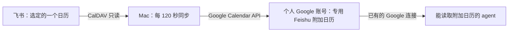

<div align="center">

# 📅 Feishu Calendar Bridge

**让飞书日程出现在个人 Google 日历里。**<br>
一个在 Mac 上运行的、单向的 Feishu CalDAV → Google Calendar 桥接工具。

[](https://github.com/Azurboy/feishu-gcal-bridge/actions/workflows/ci.yml)
[](LICENSE)
[](pyproject.toml)

[快速开始](#快速开始) · [同步与隐私边界](#同步与隐私边界) · [验收进度](#验收进度)

</div>

> [!NOTE]
> **开发预览版，当前以 `Busy` 模式运行。** 个人飞书账号 → 个人 Gmail 的首次同步和合成日程新增、改期、删除已通过真实 API 验证；连续 8 天运行、飞书界面操作与时效测试仍在进行。[查看逐项验收](docs/ACCEPTANCE_STATUS.md)。

如果你的云端 agent 能读取 Google 的**附加日历**，它就可以通过现有 Google 连接看到这个副本。项目不直接连接 ChatGPT、Cue 或 Muse；这些产品是否读取附加日历，取决于各自的连接能力和账号设置。

*A local, one-way Feishu CalDAV → personal Google Calendar bridge for agents that can read Google secondary calendars. No hosted service or direct agent integration is required.*

## 它怎么工作



飞书始终是来源，Google 日历是副本。Mac 休眠、关机或未登录时同步暂停；恢复后处理当前同步窗口。工具没有云端服务、遥测、公开 ICS 地址，也不需要模型 API key。

## 同步与隐私边界

| 项目 | 行为 |
| --- | --- |
| 范围 | 一个由你选择的飞书日历；默认过去 7 天到未来 180 天，窗口内最多 2,000 个实例 |
| Google 目标 | 首次设置时创建专用 `Feishu` 附加日历；重复设置同一来源时复用它 |
| 导出字段 | 开始/结束时间、忙闲；标题仅在通过私密事件标记检查后可选 |
| 不复制 | 地点、描述、参与人、会议链接、附件及其他日历 |
| 删除 | 窗口内的缺失需两次完整扫描确认；源突然全空时暂停删除 |
| 目标改动 | 不碰手工创建的 Google 事件；镜像被手改会恢复，含额外参与人的镜像会暂停处理 |

**默认 `busy` 模式**把所有标题写成 `Busy`，已在当前真实账号验证。`full` 模式可导出标题，但若飞书 CalDAV 没有给出可验证的 `CLASS:PRIVATE/CONFIDENTIAL` 标记，设置程序会拒绝启用；私密事件始终只导出 `Busy`。当前账号尚未完成私密标记的真实验收。

Google 副本不会回写飞书。获授权读取该 Google 账号日历的其他应用也可能看到你选择导出的字段；请在授权前确认自己的隐私选择。

## 快速开始

### 1. 准备两端凭据

1. **飞书：**在日历设置中生成供第三方日历使用的 CalDAV 用户名和专用密码。组织未开放此功能时，需要管理员启用。[飞书第三方日历说明](https://www.feishu.cn/hc/zh-CN/articles/079695875192-%E7%AC%AC%E4%B8%89%E6%96%B9%E6%97%A5%E5%8E%86%E5%90%8C%E6%AD%A5-%E7%AE%A1%E7%90%86%E5%91%98%E6%89%8B%E5%86%8C)
2. **个人 Google 账号：**在自己的 Google Cloud 项目中启用 Calendar API，配置 OAuth 同意屏幕，创建 **Desktop app** 类型的 OAuth client，并把下载的 JSON 放在仓库外。工具只申请 `calendar.app.created`，用于创建和管理它自己的附加日历。[桌面 OAuth](https://developers.google.com/identity/protocols/oauth2/native-app) · [Calendar 权限](https://developers.google.com/workspace/calendar/api/auth)
3. **Mac：**安装 Python 3.12+ 和 [uv](https://docs.astral.sh/uv/)；也可用 `python3 -m venv` 和 `pip install -e .`。

> [!IMPORTANT]
> 若 Google OAuth 同意屏幕仍为 **External / Testing**，带日历权限的 refresh token 通常约 7 天到期。当前真实账号仍处于 Testing；长期使用需按 Google 政策处理发布状态并重新验证。Production 状态也不等于审核通过或 token 永不失效。[Google token 生命周期](https://developers.google.com/identity/protocols/oauth2)

### 2. 安装并授权

```sh
git clone https://github.com/Azurboy/feishu-gcal-bridge.git
cd feishu-gcal-bridge
uv sync --locked
uv run fgbridge setup
```

`setup` 会隐藏输入飞书专用密码，让你选一个来源日历，再使用 Google Desktop client JSON 在浏览器授权。默认 CalDAV 地址为 `https://caldav.feishu.cn/`。若飞书未返回来源时区，输入 IANA 时区名称（例如 `Asia/Shanghai`）。设置成功后会立即进行首次同步；再次设置同一绑定不会创建第二个 Google 日历。

先在飞书创建一个**不含工作信息的测试日程**，确认它出现在 Google 的 `Feishu` 附加日历中。请留意 Google 和 agent 各自的刷新延迟；本项目的 5 分钟可见目标尚未完成实测验收。

### 3. 开启定时同步

```sh
uv run fgbridge sync --dry-run   # 预览预计变更，不写 Google
uv run fgbridge status           # 查看最近完整成功与错误码
uv run fgbridge schedule install # 当前 Mac 用户登录期间，每 120 秒运行
```

需要手动触发时运行 `uv run fgbridge sync`。`status` 距上次完整成功超过 10 分钟会提示陈旧。`--dry-run` 不推进“连续两次缺失”的删除计数。

若源突然从非空变为全空，先确认飞书日历和 CalDAV 确实返回空窗口，再运行 `uv run fgbridge sync --confirm-empty`；不要仅凭一次空结果清空 Google 副本。

## 停用与数据位置

`uv run fgbridge schedule remove` 只停止后台任务，保留 Google 副本。彻底退出时，在 Google Calendar **手工删除本工具创建的附加日历**，撤销 Google OAuth 授权，在飞书撤销 CalDAV 专用密码，最后删除本机 `~/Library/Application Support/fgbridge/` 的配置、token 和状态文件。不要删除其他 Google 日历。

本地凭据目录权限为 `0700`，文件为 `0600`；文件权限保护不等于加密。日志只记录数量和错误码，不记录标题、密码、token 或原始 ICS。

## 验收进度

**已经验证：**33 项合成测试；个人飞书与 Gmail 首次同步时，窗口内 26 个实例写入并从 Google API 读回；无参会人的合成日程新增、改期、删除；重复运行 `setup` 后来源、安装身份和目标日历均保持不变。Mac `launchd` 正在运行。

**仍需验证：**飞书 UI 中重复日程“仅此/此后/全部”、真实私密标记、至少 20 次时效测量、休眠恢复，以及连续 8 天运行与 Google Testing token 的到期行为。因此暂不宣称稳定的同步时效或适用于所有飞书租户。

```sh
uv sync --locked --extra dev
uv run --extra dev pytest -q
```

完整边界见[开发规格](docs/DEVELOPMENT_SPEC_v0.1.md)，每天的真实运行证据见[验收状态](docs/ACCEPTANCE_STATUS.md)，背景与社区项目见[调研](docs/RESEARCH_AND_LAUNCH.md)。发现兼容问题时，请提交操作步骤、预期/实际时间、脱敏错误码和版本；不要上传 token、专用密码、完整 ICS 或真实会议内容。

本项目采用 [MIT License](LICENSE)，并非飞书或 Google 的官方产品。
